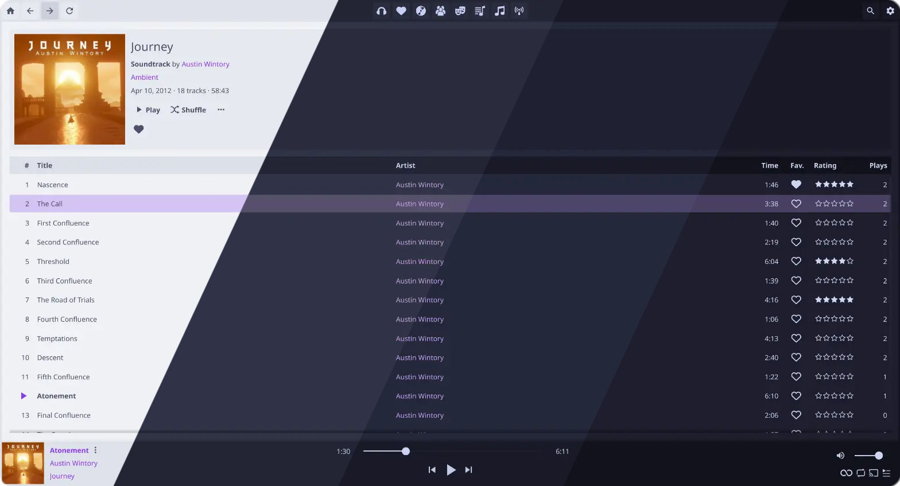
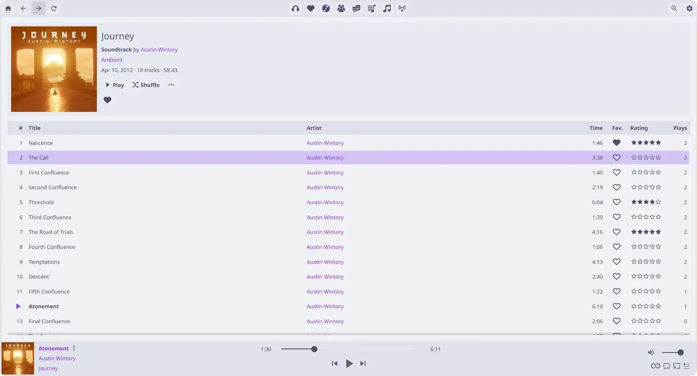

<h3 align="center">
	 
	
	Catppuccin for <a href="https://github.com/dweymouth/supersonic">Supersonic</a>
	
</h3>

	
	
	

	

## Previews

🌻 Latte

🪴 Frappé

🌺 Macchiato

🌿 Mocha

## Usage

1. Download the flavor of your choice.
2. Place the downloaded theme file into your [theme directory](https://github.com/dweymouth/supersonic/wiki/Custom-Themes).
3. In Supersonic, navigate to **Settings...** -> **Appearance** -> **Theme**, and select your chosen theme.
4. Make sure to set **Mode** to **Dark** or **Light** depending on your chosen theme.

## 💝 Thanks to

- [Chippit](https://github.com/Chippit)

&nbsp;

	

	Copyright &copy; 2021-present <a href="https://github.com/catppuccin" target="_blank">Catppuccin Org</a>

	

